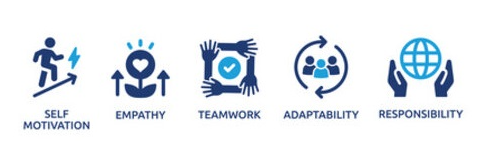

<!--

  
  <h1><strong> Andrea Martínez Sánchez </strong></h1>
  

    <strong>Software Developer</strong> 
  

  

 
-->
  Hi! 👋🏻 I'm **Andrea**. I enjoy collaborating in team environments, where I can take on new challenges and contribute to making something great  I truly value the process of building projects that make a real difference, paying attention to the smallest details 🌟

 

## 💻 Work
- ♠️ Java Backend Developer at Capgemini 
  

## ✏️ Education
- 💻 Vocational training in Web Application Development
- 🔭 Backend Bootcamp at Factoría F5
- 🌐 English C1 🎧📚 and B2 🖋️💬 from Oxford ToE and English Studies Degree
  

## 🛠️ Tech Stack
- **Backend:**

  
  
  
 

- **Frontend:**

  
  
  
  
  
- **Databases:**
  
  
  

- **Tools:**
  
  
  
    
  
  
  
  
  

- **Project Management and Productivity:**

  
  
  
  
  
## 👤 Soft Skills
 

## 📫 Contact
    
  
  
   
🔹<small><i>Practice Hours by Technology</i></small>🔹

